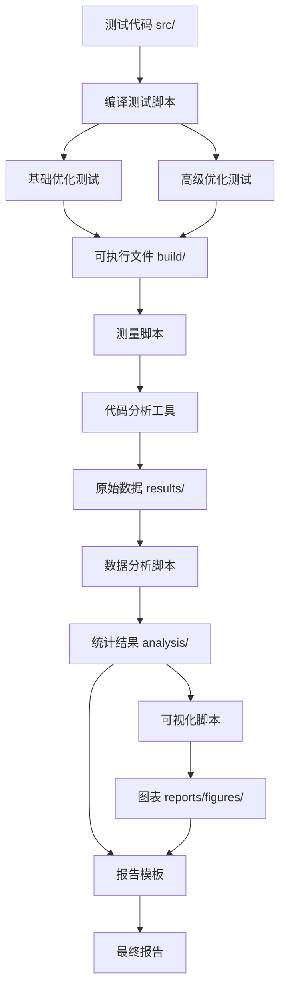

# 设计文档

## 概述

本项目设计一个模块化的代码空间优化研究系统，包含自动化测试、数据分析和可视化三个主要组件。系统采用Shell脚本进行编译和测量，使用Python进行数据分析和可视化，确保在Ubuntu环境下的可移植性和易用性。

## 架构

### 系统架构图



### 目录结构

```
project/
├── src/                          # 测试源代码
│   ├── fibonacci.c
│   ├── linked_list.c
│   ├── matrix_add.c
│   ├── matrix_mult.c
│   ├── popcount.c
│   ├── quicksort.c
│   └── string_search.c
├── scripts/                      # 自动化脚本
│   ├── run_tests.sh             # 主测试脚本
│   ├── analyze_data.py          # 数据分析脚本
│   └── visualize.py             # 可视化脚本
├── build/                        # 编译输出（自动生成）
│   ├── gcc/
│   │   ├── O0/
│   │   ├── O1/
│   │   ├── O2/
│   │   ├── O3/
│   │   ├── Os/
│   │   ├── lto/
│   │   └── pgo/
│   └── clang/
│       ├── O0/
│       ├── O1/
│       ├── O2/
│       ├── O3/
│       ├── Os/
│       ├── Oz/
│       ├── lto/
│       └── pgo/
├── results/                      # 测量数据（自动生成）
│   ├── code_size.csv
│   ├── objdump/
│   ├── readelf/
│   └── nm/
├── analysis/                     # 分析结果（自动生成）
│   ├── summary_statistics.csv
│   ├── compiler_comparison.csv
│   └── optimization_impact.csv
├── reports/                      # 报告和图表（自动生成）
│   ├── figures/
│   │   ├── code_size_by_program.png
│   │   ├── optimization_comparison.png
│   │   └── compiler_comparison.png
│   └── REPORT_TEMPLATE.md
├── Makefile                      # 构建和清理
└── README.md                     # 项目文档
```

## 组件和接口

### 1. 编译测试脚本 (run_tests.sh)

**职责**: 自动化编译所有测试程序，使用不同的编译器和优化选项

**输入**:
- 源代码文件 (src/*.c)
- 编译器列表: gcc, clang
- 优化级别列表: -O0, -O1, -O2, -O3, -Os, -Oz (仅Clang)

**输出**:
- 编译后的可执行文件 (build/[compiler]/[opt_level]/[program])
- 编译日志
- 代码大小测量数据 (results/code_size.csv)

**关键功能**:
```bash
# 基础编译函数
compile_program() {
    compiler=$1      # gcc 或 clang
    opt_level=$2     # -O0, -O1, -O2, -O3, -Os, -Oz
    source_file=$3   # 源文件路径
    output_dir=$4    # 输出目录
}

# 测量代码大小
measure_size() {
    executable=$1
    # 使用 size 命令提取 text, data, bss
    size -A "$executable"
}

# LTO编译
compile_with_lto() {
    compiler=$1
    source_file=$2
    output_file=$3
    # 添加 -flto 标志
}

# PGO编译（两阶段）
compile_with_pgo() {
    compiler=$1
    source_file=$2
    output_file=$3
    # 阶段1: -fprofile-generate
    # 运行程序收集profile数据
    # 阶段2: -fprofile-use
}
```

**工具集成**:
```bash
# objdump: 反汇编
objdump -d executable > results/objdump/program_compiler_opt.asm

# readelf: ELF信息
readelf -a executable > results/readelf/program_compiler_opt.txt

# nm: 符号表
nm -S executable > results/nm/program_compiler_opt.txt
```

### 2. 数据分析脚本 (analyze_data.py)

**职责**: 处理原始测量数据，生成统计分析和比较报告

**输入**:
- results/code_size.csv

**输出**:
- analysis/summary_statistics.csv
- analysis/compiler_comparison.csv
- analysis/optimization_impact.csv

**数据模型**:
```python
class CodeSizeData:
    program: str          # 程序名称
    compiler: str         # gcc 或 clang
    opt_level: str        # 优化级别
    text_size: int        # text段大小
    data_size: int        # data段大小
    bss_size: int         # bss段大小
    total_size: int       # 总大小
    timestamp: str        # 测量时间
```

**关键功能**:
```python
def load_data(csv_file):
    """加载CSV数据到DataFrame"""
    pass

def calculate_statistics(df):
    """计算每个程序的统计信息"""
    # 平均值、中位数、标准差
    # 按编译器和优化级别分组
    pass

def compare_compilers(df):
    """比较GCC和Clang的代码大小"""
    # 相同优化级别下的差异
    # 百分比差异
    pass

def analyze_optimization_impact(df):
    """分析优化级别的影响"""
    # 相对于-O0的代码大小减少
    # 识别最有效的优化级别
    pass

def generate_summary_report(df):
    """生成汇总报告"""
    pass
```

### 3. 可视化脚本 (visualize.py)

**职责**: 生成图表和可视化，展示分析结果

**输入**:
- results/code_size.csv
- analysis/*.csv

**输出**:
- reports/figures/*.png

**关键功能**:
```python
def plot_code_size_by_program(df):
    """为每个程序生成代码大小对比图"""
    # 柱状图: 不同优化级别的代码大小
    # 分组: 编译器
    pass

def plot_optimization_comparison(df):
    """生成优化级别对比图"""
    # 折线图: 显示优化级别的趋势
    # 所有程序的平均值
    pass

def plot_compiler_comparison(df):
    """生成编译器对比图"""
    # 并排柱状图: GCC vs Clang
    # 按优化级别分组
    pass

def plot_advanced_optimizations(df):
    """生成高级优化对比图"""
    # LTO和PGO的效果
    pass

def plot_size_reduction_heatmap(df):
    """生成代码大小减少热力图"""
    # 程序 x 优化级别
    pass
```

**可视化库**: matplotlib, seaborn, pandas

## 数据模型

### CSV数据格式 (code_size.csv)

```csv
program,compiler,opt_level,text_size,data_size,bss_size,total_size,timestamp
fibonacci,gcc,O0,1234,256,8,1498,2025-11-09T10:30:00
fibonacci,gcc,O1,987,256,8,1251,2025-11-09T10:30:05
fibonacci,gcc,O2,876,256,8,1140,2025-11-09T10:30:10
...
```

### 统计汇总格式 (summary_statistics.csv)

```csv
program,compiler,metric,O0,O1,O2,O3,Os,Oz,lto,pgo
fibonacci,gcc,mean_total,1498,1251,1140,1089,1023,N/A,1001,987
fibonacci,gcc,reduction_pct,0%,16.5%,23.9%,27.3%,31.7%,N/A,33.2%,34.1%
...
```

## 错误处理

### 编译错误
- 捕获编译失败并记录到日志
- 继续处理其他测试用例
- 在最终报告中标记失败的配置

### 工具缺失
- 在脚本开始时检查必需工具
- 提供清晰的错误消息和安装建议
```bash
check_tools() {
    for tool in gcc clang size objdump readelf nm; do
        if ! command -v $tool &> /dev/null; then
            echo "Error: $tool not found"
            echo "Install: sudo apt-get install $tool"
            exit 1
        fi
    done
}
```

### 数据处理错误
- 验证CSV文件格式
- 处理缺失数据
- 提供有意义的错误消息

```python
def validate_data(df):
    required_columns = ['program', 'compiler', 'opt_level', 'text_size']
    missing = set(required_columns) - set(df.columns)
    if missing:
        raise ValueError(f"Missing columns: {missing}")
```

## 测试策略

### 单元测试
- 测试数据加载和解析函数
- 测试统计计算的正确性
- 测试图表生成不会崩溃

### 集成测试
- 端到端测试: 从编译到报告生成
- 验证所有脚本能够协同工作
- 测试不同的输入场景

### 验证测试
- 手动验证几个编译配置的代码大小
- 比对size命令的输出与CSV数据
- 检查生成的图表是否准确反映数据

### 测试命令
```bash
# 快速测试（仅一个程序）
./scripts/run_tests.sh --quick --program fibonacci

# 完整测试
./scripts/run_tests.sh --all

# 仅分析现有数据
python3 scripts/analyze_data.py

# 仅生成可视化
python3 scripts/visualize.py
```

## 性能考虑

### 编译时间优化
- 并行编译: 使用make -j或xargs -P
- 缓存编译结果: 仅在源代码更改时重新编译

### 数据处理优化
- 使用pandas进行高效的数据操作
- 避免不必要的数据复制
- 批量处理图表生成

### 存储优化
- 压缩objdump输出（可选）
- 仅保留必要的分析工具输出
- 提供清理脚本删除中间文件

## 可扩展性

### 添加新测试程序
1. 将.c文件添加到src/目录
2. 运行测试脚本自动检测并编译

### 添加新编译器
1. 在run_tests.sh中添加编译器到列表
2. 配置编译器特定的标志

### 添加新优化选项
1. 在优化级别列表中添加新选项
2. 更新文档说明新选项的含义

### 添加新分析指标
1. 在测量函数中提取新指标
2. 更新CSV格式
3. 在分析脚本中添加处理逻辑

## 依赖项

### 系统工具
- gcc (>= 9.0)
- clang (>= 10.0)
- binutils (size, objdump, readelf, nm)
- make

### Python依赖
```
pandas>=1.3.0
matplotlib>=3.4.0
seaborn>=0.11.0
numpy>=1.21.0
```

### 安装命令
```bash
# Ubuntu系统工具
sudo apt-get update
sudo apt-get install build-essential clang binutils

# Python依赖
pip3 install pandas matplotlib seaborn numpy
```

## 配置管理

### 配置文件 (config.sh)
```bash
# 编译器配置
COMPILERS="gcc clang"
GCC_OPT_LEVELS="-O0 -O1 -O2 -O3 -Os"
CLANG_OPT_LEVELS="-O0 -O1 -O2 -O3 -Os -Oz"

# 高级优化
ENABLE_LTO=true
ENABLE_PGO=true

# 输出目录
BUILD_DIR="build"
RESULTS_DIR="results"
ANALYSIS_DIR="analysis"
REPORTS_DIR="reports"

# 并行编译
PARALLEL_JOBS=4
```

## 文档要求

### README.md内容
1. 项目简介和目标
2. 系统要求和依赖安装
3. 快速开始指南
4. 详细使用说明
5. 输出文件说明
6. 故障排除
7. 项目结构说明

### 报告模板内容
1. 项目概述
2. 实验环境
3. 测试方法
4. 实验结果（数据表格和图表）
5. 分析和讨论
6. 结论
7. 参考文献
8. 附录（源代码列表）
